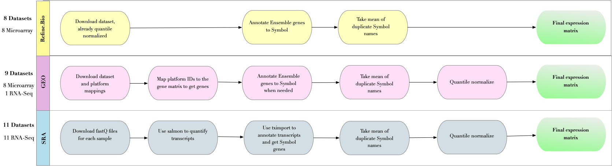

Molecular Subtypoing of Sepsis
================

This repository is associated with the manuscript and GEO Dataset
`GSE310929` Here we walk through processing of datasets presented in the
associated paper, as well as provide examples of using the dataset.

<figure>

<figcaption aria-hidden="true">Method Overview</figcaption>
</figure>

## Dataset Processing

We survey refine.bio, GEO, and SRA for transcriptomic datasets with
adult patients meeting sepsis/septic shock criteria. The datasets
included in final analysis are:
[GSE100159](https://www.ncbi.nlm.nih.gov/geo/query/acc.cgi?acc=GSE100159),
[GSE13015](https://www.ncbi.nlm.nih.gov/geo/query/acc.cgi?acc=GSE13015),
[GSE131761](https://www.ncbi.nlm.nih.gov/geo/query/acc.cgi?acc=GSE131761),
[GSE134347](https://www.ncbi.nlm.nih.gov/geo/query/acc.cgi?acc=GSE134347),
[GSE137340](https://www.ncbi.nlm.nih.gov/geo/query/acc.cgi?acc=GSE137340),
[GSE154918](https://www.ncbi.nlm.nih.gov/geo/query/acc.cgi?acc=GSE154918),
[GSE185263](https://www.ncbi.nlm.nih.gov/geo/query/acc.cgi?acc=GSE185263),
[GSE189400](https://www.ncbi.nlm.nih.gov/geo/query/acc.cgi?acc=GSE189400),
[GSE196117](https://www.ncbi.nlm.nih.gov/geo/query/acc.cgi?acc=GSE196117),
[GSE199816](https://www.ncbi.nlm.nih.gov/geo/query/acc.cgi?acc=GSE199816),
[GSE211210](https://www.ncbi.nlm.nih.gov/geo/query/acc.cgi?acc=GSE211210),
[GSE216902](https://www.ncbi.nlm.nih.gov/geo/query/acc.cgi?acc=GSE216902),
[GSE222393](https://www.ncbi.nlm.nih.gov/geo/query/acc.cgi?acc=GSE222393),
[GSE232404](https://www.ncbi.nlm.nih.gov/geo/query/acc.cgi?acc=GSE232404),
[GSE232753](https://www.ncbi.nlm.nih.gov/geo/query/acc.cgi?acc=GSE232753),
[GSE236713](https://www.ncbi.nlm.nih.gov/geo/query/acc.cgi?acc=GSE236713),
[GSE236892](https://www.ncbi.nlm.nih.gov/geo/query/acc.cgi?acc=GSE236892),
[GSE32707](https://www.ncbi.nlm.nih.gov/geo/query/acc.cgi?acc=GSE32707),
[GSE33118](https://www.ncbi.nlm.nih.gov/geo/query/acc.cgi?acc=GSE33118),
[GSE57065](https://www.ncbi.nlm.nih.gov/geo/query/acc.cgi?acc=GSE57065),
[GSE63311](https://www.ncbi.nlm.nih.gov/geo/query/acc.cgi?acc=GSE63311),
[GSE65682](https://www.ncbi.nlm.nih.gov/geo/query/acc.cgi?acc=GSE65682),
[GSE66890](https://www.ncbi.nlm.nih.gov/geo/query/acc.cgi?acc=GSE66890),
[GSE69063](https://www.ncbi.nlm.nih.gov/geo/query/acc.cgi?acc=GSE69063),
[GSE74224](https://www.ncbi.nlm.nih.gov/geo/query/acc.cgi?acc=GSE74224),
[GSE95233](https://www.ncbi.nlm.nih.gov/geo/query/acc.cgi?acc=GSE95233),
[SRP198776](https://www.ncbi.nlm.nih.gov/geo/query/acc.cgi?acc=GSE131411),
[GSE310929](https://www.ncbi.nlm.nih.gov/geo/query/acc.cgi?acc=GSE310929).

We preprocess each dataset individually to ensure consistent format and
to maximize comparability. Metadata from all studies is consolidated
into a single file and then cleaned pre- and post- batch correction
using scripts `code/Metadata_Clean_PreBatchCorrection.R` and
`code/Metadata_Clean_PostBatchCorrection.R`.

<figure>

<figcaption aria-hidden="true">Dataset Processing Pipeline</figcaption>
</figure>

## Batch Correction

All samples from each datasets are used in in batch correction. Datasets
are combined into a single matrix using `code/Create_master_matrix.R`.
Batch correction was done in R using ComBat
(`code/Batch_correction_pca.R`). Processed expression data and metadata
for all 3,713 samples included in batch correction are included as Rdata
in this repo in data/ and provided at TODO add GEO ID labeled
`AllSampleExpressionSubmitted.tsv` and
`AllSampleMetadataSubmitted.xlsx`.

We can look at samples before and after batch correction here: 

Samples values after batch correction are provided in GEO dataset: GSE
TODO.

We can read in all samples here:

``` r
all_metadata <- readRDS(here::here("data","all_samples_metadata.rds"))
all_expr <- readRDS(here::here("data","all_samples_expression.rds"))
```

Lets look at the metadata we have for this dataset. We have 68 columns
in this file, comprising all metadata available for each included study.

``` r
colnames(all_metadata)
```

    ##  [1] "Sample ID"                    "Dataset"                     
    ##  [3] "GEO Accession"                "Platform ID"                 
    ##  [5] "Source"                       "Reanalyzed by another study" 
    ##  [7] "Tissue"                       "Sample Class"                
    ##  [9] "Disease"                      "Disease 2"                   
    ## [11] "Disease Simplified"           "ARDs"                        
    ## [13] "Sepsis/Septic Shock"          "Timepoint"                   
    ## [15] "Is Repeat Sample"             "Low Platelets"               
    ## [17] "RNA-seq/Microarray"           "Treatment"                   
    ## [19] "Responder"                    "Survival"                    
    ## [21] "Age"                          "Gender"                      
    ## [23] "ifng il10 ratio"              "Ethinicity"                  
    ## [25] "Race"                         "Pathogen"                    
    ## [27] "Title"                        "Patient ID"                  
    ## [29] "Covid Status"                 "SOFA (24hr)"                 
    ## [31] "RepSOFA"                      "SAPSII"                      
    ## [33] "Organ Failure Count"          "Cardiovascular Failure"      
    ## [35] "Liver Failure"                "AKI"                         
    ## [37] "Coagulation Failure"          "Respiratory Failure"         
    ## [39] "SIRS Sign"                    "Culture Positive"            
    ## [41] "Pneumonia Diagnosis"          "Thrombocytonpenia"           
    ## [43] "Endotype Cohort"              "PreviouslyDefinedSubtypes"   
    ## [45] "Time to Event"                "ICU Aquired Infection"       
    ## [47] "ICU Aquired Infection Paired" "Diabeties Mellitus"          
    ## [49] "Abdominal Sepsis"             "WBC Cells per UL"            
    ## [51] "Direct Lung"                  "AECC ALI"                    
    ## [53] "Berlin ARDs"                  "Shock"                       
    ## [55] "Severity"                     "AgeSummary"                  
    ## [57] "UnderlyingDisease"            "RenalDysfunction"            
    ## [59] "LiverDysfunction"             "MechanicalVentilation"       
    ## [61] "Group"                        "InfectionOrigin"             
    ## [63] "OnPressors"                   "Immunocompromised"           
    ## [65] "Antibiotics"                  "DaySurvivalEdited"           
    ## [67] "TimetoEventEdited"            "MolecularSubtype"

Importantly, columns used in our analysis include:

| Column Name                 | Description                               |
|-----------------------------|-------------------------------------------|
| `Sample ID`                 | Sample ID                                 |
| `Dataset`                   | Associated Dataset ID                     |
| `Disease`                   | Unedited disease classification           |
| `Disease Simplified`        | Edited/simplified disease classification  |
| `Timepoint`                 | Time sample was taken                     |
| `Is Repeat Sample`          | Whether sample was first from the patient |
| `Sepsis/Septic Shock`       | Sepsis-shock classification               |
| `Shock`                     | Shock classification                      |
| `Survival`                  | Mortality classification                  |
| `Time to Event`             | Time to mortality event                   |
| `Gender`                    | Sample Sex                                |
| `Age`                       | Sample Age                                |
| `Race`                      | Sample Race                               |
| `PreviouslyDefinedSubtypes` | Subtype assigned by previous study        |

Lets look at all diseases present in this file:

``` r
table(all_metadata$`Disease`)
```

    ## 
    ##            Acute Sepsis             Anaphylaxis       Cardiogenic Shock 
    ##                       5                      33                      36 
    ##                 Control         Control/healthy        Control/Recovery 
    ##                      95                       3                       9 
    ## Control/type 2 diabetes            COVID Sepsis                COVID-19 
    ##                       7                      31                       9 
    ##             Head Trauma                 Healthy         Healthy control 
    ##                      30                     189                      33 
    ##               No Sepsis               No-Sepsis        Non-Septic Shock 
    ##                      35                      80                      33 
    ##                    None           Noninfectious           post-surgical 
    ##                       8                      59                      31 
    ##                    SAKI                  Sepsis        Sepsis Follow Up 
    ##                       5                    2030                       4 
    ##      Sepsis-Melioidosis  Sepsis-Other Infection         Sepsis-Recovery 
    ##                      18                      15                       2 
    ##      Sepsis/Melioidosis Sepsis/Other infections               SepsisBSI 
    ##                      24                      24                      56 
    ##            Sepsisperiph             Septic ARDs            Septic Shock 
    ##                      65                      39                     489 
    ##  Septic Shock Follow Up  Septic Shock with ARDs           Severe Sepsis 
    ##                      10                      20                      26 
    ##                    SIRS Uncomplicated Infection               untreated 
    ##                     114                      12                      34

Now lets look at the simplified disease column. We have taken the
diseases in `Disease` and cleaned them in this column for simplicity.

``` r
table(all_metadata$`Disease Simplified`)
```

    ## 
    ##                                              Control 
    ##                                                  344 
    ## Intubated subjects undergoing mechanical ventilation 
    ##                                                   34 
    ##                    Uncomplicated baterical infection 
    ##                                                   12 
    ##                                          Anaphylaxis 
    ##                                                   33 
    ##                          ICU noninfectious condition 
    ##                                                   59 
    ##                                          Head Trauma 
    ##                                                   30 
    ##                                     Critical Illness 
    ##                                                   80 
    ##                                             COVID-19 
    ##                                                    9 
    ##                                    Cardiogenic Shock 
    ##                                                   36 
    ##           Potential for sepsis but was not developed 
    ##                                                   35 
    ##                                                 SIRS 
    ##                                                  178 
    ##                                         Sepsis - AKI 
    ##                                                    5 
    ##                                               Sepsis 
    ##                                                 2263 
    ##                                        Sepsis - ARDs 
    ##                                                   99 
    ##                                       Sepsis - Shock 
    ##                                                  496

Similarly, we can look at samples included in our study (sepsis samples
only):

``` r
disease_metadata <- readRDS(here::here("data","disease_metadata.rds"))
disease_expr <- readRDS(here::here("data","disease_expression.rds"))
table(disease_metadata$`Disease Simplified`)
```

    ## 
    ##         Sepsis Sepsis - Shock 
    ##           1887            364

# Pipeline Script Descriptions

| Script ID | Script name | Purpose / Function | Inputs | Outputs |
|----|----|----|----|----|
| S01 | 01_Create_master_matrix.R | Load and combine all datasets into a single matrix | `datasets/*/QN_Expression.tsv`: 28 individual preprocessed datasets. <br> `metadata.tsv`: Original manually curated metadata file | `data/raw_all_samples_expression.rds`: Single matrix with raw expression values from all datasets combined, sample × feature. <br> `data/batchIDs_allSamples.rds`: Batch IDs for use in ComBat <br> `data/all_samples_metadata.rds`: Cleaned metadata file |
| S02 | 02_Metadata_clean_pre_batch_correction.R | Perform initial cleaning of metadata from manually curated file. | `Metadata.tsv`: Manually curated metadata file for all samples in every study. Not provided in repository. | `data/ll_samples_metadata.rds`: Cleaned metadata matrix. |
| S03 | 03_Batch_correction_pca.R | Perform batch correction to remove techinical variation | `data/raw_all_samples_expression.rds`: Single matrix with raw expression values from all datasets combined, sample × feature from S01. <br> `data/batchIDs_allSamples.rds`: Batch IDs for use in ComBat from S01 <br> `data/all_samples_metadata.rds`: Cleaned metadata file from TODO <br> `data/disease_metadata.rds`: Cleaned metadata file for disease samples only from TODO | `data/all_samples_expression.rds`:Batch corrected expression matrix for all samples and all genes <br> `data/Init_PCA_values_allSamples.rds`:PCA values for all samples prior to batch correction <br> `TODO PCA values for all samples after batch correction`:<br> `data/disease_expression_all_genes.rds`: Expression values for sepsis samples only after batch correction |
| S04 | 04_Metadata_clean_post_batch_correction | Perform additional cleaning of metadata, reduce sepsis samples only, clean categories such as race and gender. | `data/all_samples_metadata.rds`: Cleaned metadata matrix. | `data/disease_metadata.rds`: Metadata for sepsis samples only. |
| S05 | 05_Cut_mixed_genes.R | Cut down genes to immune related genes, lipid genes , and most varaible genes. | `data/disease_expression_all_genes.rds`: Expression values for sepsis samples only after batch correction <br> `data/disease_metadata.rds`: Metadata for sepsis samples only. | `data/disease_expression.rds`: Expression for sepsis samples and selected genes. |
| S06 | 06_Cluster_compares.R | Perform unsupercised clustering analysis with KM, HC, and PAM method and compare cluster results. | `data/disease_expression.rds`: Expression for sepsis samples and selected genes from S05. | `results/pathway_results.rds`: Enrichment scores and adjusted p‑values for each pathway. |
| S06 | 06_Silhouette_scores.R | Function called from 06_Cluster_compares.R, function calculates silhouette scores for given clusters.. | Median centered matrix from 06_Cluster_compares.R, created in 06_Cluster_compares.R and passed as a parameter to function. | `results/cluster_compares/{PAM, HC, KM}/Sample_Cluster_Assignments_i.tsv`: tsv holding assigned cluster IDs for each sample for each K with given clustering algorithm. <br> `results/cluster_compares/{PAM, HC, KM}/Sil_Scores.log`: Log holding results from silouette calcualtion for every K for given clustering algorithm. <br> `results/cluster_compares/{PAM, HC, KM}/ClusterIDs.rds`: R object holding assigned cluster IDs for each sample for each K with given clustering algorithm. |
| S07 | 07_Differential_expression_analysis.R | Conduct differential expression analysis for each molecular subtype. | `data/disease_expression.rds`: Expression for sepsis samples and selected genes. <br> : `data/disease_metadata.rds`: Metadata for sepsis samples only. | `results/differential_expression/*`: Differential expression results for each molecular subtype. |
| S08 | 08_Cluster_DE_analysis.R | Idnetify genes that are differentially expressed in a cluster in the same direction in all 3 comparisons to other molecular subtypes, and assign that gene to the molecular subtype. | `results/differential_expression/*.tsv`: Results from each molecular subtype differential expression comparison (each molecular subtype is compared to every other molecular subtype). | `results/differential_expression/*_DEALL_genes.tsv`: File holding differentially expressed genes for each molecular subtype comparison with annotation for how many times the gene is differentially expressed for that subtype. |
| S09 | 09_Mortality_analysis.R | Script to calculate RMST for each cluster and create Kaplan Meier plot. | `data/disease_metadata.rds`; Metadata for sepsis samples only. | `results/survival_analysis/RMST1VSAll.log`: RMST results for each cluster (calcuated as 1 VS all others). <br> `results/survival_analysis/Survival_DE.{rds, tsv}` <br> This script also created the Kaplan Meier plot and volcano plot for survival. |
| S10 | 10_Stats.R | Statistical analysis of demoraphic variables. | `data/disease_metadata.rds`: Metadata for sepsis samples only. <br> `data/disease_expression.rds`: Expression for sepsis samples and selected genes. | `results/stats/*`: Statistical results for molecular subtypes and all demographic variables. |
